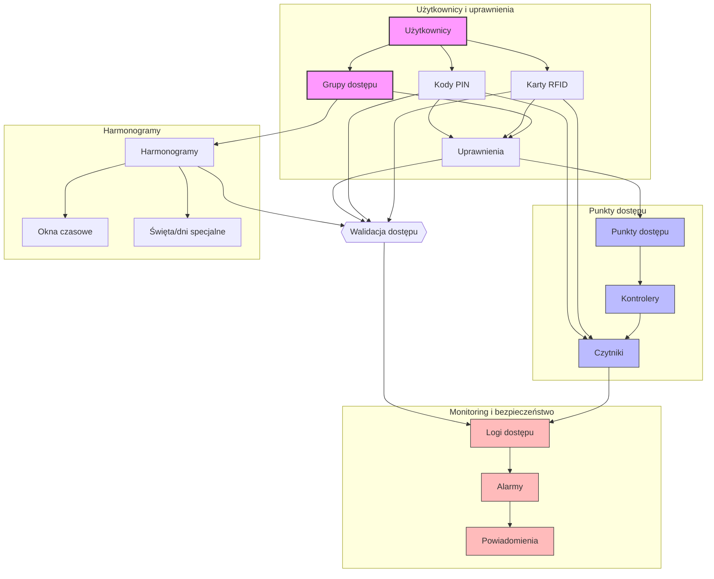

# System Kontroli Dostępu - Dokumentacja API

## Spis treści

1. [Wprowadzenie](#wprowadzenie)
2. [Podstawowe funkcjonalności](#podstawowe-funkcjonalności)
3. [Zarządzanie użytkownikami](#zarządzanie-użytkownikami)
4. [Grupy dostępu](#grupy-dostępu)
5. [Karty RFID i kody PIN](#karty-rfid-i-kody-pin)
6. [Harmonogramy dostępu](#harmonogramy-dostępu)
7. [Punkty dostępu](#punkty-dostępu)
8. [Alarmy i powiadomienia](#alarmy-i-powiadomienia)
9. [Logi dostępu](#logi-dostępu)

## Wprowadzenie

API systemu kontroli dostępu zostało zaprojektowane zgodnie z zasadami REST. Wszystkie endpointy przyjmują i zwracają dane w formacie JSON. Autentykacja odbywa się poprzez token Bearer w nagłówku HTTP.

### Format odpowiedzi

```json
{
    "status": "success|error",
    "data": {},
    "message": "Opcjonalny komunikat"
}
```

## Podstawowe funkcjonalności

### Endpointy główne

- `/users` - zarządzanie użytkownikami
- `/access-groups` - zarządzanie grupami dostępu
- `/cards` - zarządzanie kartami RFID
- `/pins` - zarządzanie kodami PIN
- `/schedules` - zarządzanie harmonogramami
- `/access-points` - zarządzanie punktami dostępu
- `/alerts` - zarządzanie alarmami
- `/access-logs` - logi dostępu

## Zarządzanie użytkownikami

### GET /users

Pobiera listę użytkowników.

Parametry query:

- `groupId` (opcjonalny) - filtrowanie po grupie dostępu
- `status` (opcjonalny) - filtrowanie po statusie

Przykładowa odpowiedź:

```json
{
    "data": [{
        "id": "user123",
        "firstName": "Jan",
        "lastName": "Kowalski",
        "status": "active",
        "accessGroups": ["group1", "group2"],
        "hasPIN": true,
        "rfidCards": []
    }]
}
```

### POST /users

Tworzy nowego użytkownika.

Przykładowy request:

```json
{
    "firstName": "Jan",
    "lastName": "Kowalski",
    "accessGroups": ["group1"]
}
```

## Grupy dostępu

### GET /access-groups

Pobiera listę grup dostępu.

### POST /access-groups

Tworzy nową grupę dostępu.

Przykładowy request:

```json
{
    "name": "Pracownicy biurowi",
    "description": "Dostęp do pomieszczeń biurowych",
    "accessPoints": ["door1", "door2"],
    "scheduleId": "schedule1"
}
```

## Karty RFID i kody PIN

### POST /cards

Rejestruje nową kartę RFID.

Przykładowy request:

```json
{
    "cardNumber": "ABC123456",
    "userId": "user123",
    "type": "standard",
    "requiresPIN": true
}
```

### POST /pins

Ustawia lub zmienia kod PIN.

Przykładowy request:

```json
{
    "userId": "user123",
    "newPIN": "1234",
    "requirePINForAccess": true
}
```

### POST /access/validate

Weryfikuje dostęp (karta + PIN).

Przykładowy request:

```json
{
    "cardNumber": "ABC123456",
    "pin": "1234",
    "accessPointId": "door1"
}
```

## Harmonogramy dostępu

### GET /schedules

Pobiera listę harmonogramów.

### POST /schedules

Tworzy nowy harmonogram.

Przykładowy request:

```json
{
    "name": "Standardowy czas pracy",
    "timeWindows": [
        {
            "dayOfWeek": 1,
            "startTime": "08:00",
            "endTime": "18:00"
        }
    ],
    "holidays": ["2024-12-25"]
}
```

## Punkty dostępu

### GET /access-points

Pobiera listę punktów dostępu.

Przykładowa odpowiedź:

```json
{
    "data": [{
        "id": "door1",
        "name": "Wejście główne",
        "type": "door",
        "status": "active",
        "location": "Parter"
    }]
}
```

## Alarmy i powiadomienia

### GET /alerts

Pobiera listę alertów.

Parametry query:

- `status` - active|resolved|all
- `severity` - low|medium|high|critical

### POST /alerts/{alertId}/resolve

Oznacza alert jako rozwiązany.

### GET /notifications/settings

Pobiera ustawienia powiadomień.

Przykładowa odpowiedź:

```json
{
    "emailNotifications": true,
    "smsNotifications": false,
    "pushNotifications": true,
    "alertTypes": ["unauthorized_access", "door_forced"],
    "minSeverity": "medium"
}
```

## Logi dostępu

### GET /access-logs

Pobiera logi dostępu.

Parametry query:

- `startDate` - data początkowa
- `endDate` - data końcowa
- `userId` (opcjonalny) - filtrowanie po użytkowniku
- `accessPointId` (opcjonalny) - filtrowanie po punkcie dostępu

Przykładowa odpowiedź:

```json
{
    "data": [{
        "timestamp": "2024-12-17T08:30:00Z",
        "userId": "user123",
        "accessPointId": "door1",
        "eventType": "granted",
        "authMethod": "card_and_pin"
    }]
}
```

## Modele danych

### User

```json
{
    "id": "string",
    "firstName": "string",
    "lastName": "string",
    "status": "active|inactive|blocked",
    "accessGroups": ["string"],
    "hasPIN": "boolean",
    "pinLastChanged": "datetime",
    "rfidCards": ["RFIDCard"]
}
```

### RFIDCard

```json
{
    "id": "string",
    "cardNumber": "string",
    "status": "active|inactive|lost|stolen",
    "type": "standard|temporary|visitor",
    "issueDate": "datetime",
    "expiryDate": "datetime",
    "requiresPIN": "boolean"
}
```

### AccessGroup

```json
{
    "id": "string",
    "name": "string",
    "description": "string",
    "accessPoints": ["string"],
    "scheduleId": "string",
    "members": ["string"]
}
```

### Schedule

```json
{
    "id": "string",
    "name": "string",
    "timeWindows": [{
        "dayOfWeek": "integer",
        "startTime": "time",
        "endTime": "time"
    }],
    "holidays": ["date"],
    "specialDays": [{
        "date": "date",
        "timeWindows": [{
            "startTime": "time",
            "endTime": "time"
        }]
    }]
}
```

### Alert

```json
{
    "id": "string",
    "type": "unauthorized_access|door_forced|device_offline|security_breach",
    "severity": "low|medium|high|critical",
    "status": "active|resolved",
    "timestamp": "datetime",
    "location": "string",
    "description": "string"
}
```



## Endpint dla klawiatury/RFID

### 1. Weryfikacja kodu z klawiatury

Proces można zrealizować na dwa sposoby
Wysyłając obiekt post na odpowiedni Endpoint
**Endpoint:** `GET /access/verify/acesspint`

```json
{
   "device_id":"esp32-123456",
   "timestamp":"2024-12-19T12:34:56Z",
   "rfid":"AB12CD34",
   "reader_type":"scaner",
   "operation_mode":"read",
}
```

- `"reader_type":"scaner"` lub `reader_type":"keyboard"`

### Procedura oparata o GET

**Endpoint:** `GET /access/verify/keypad`

Przeznaczony do szybkiej weryfikacji kodów wprowadzanych na klawiaturze przy drzwiach/bramkach.

**Parametry:**

- `code` - wprowadzony kod PIN
- `deviceId` - identyfikator czytnika/klawiatury

**Zastosowanie:**

- Wejścia tylko na kod PIN
- Pomieszczenia z niższym poziomem bezpieczeństwa
- Dostęp tymczasowy dla gości

### 2. Weryfikacja karty RFID

**Endpoint:** `GET /access/verify/rfid`

Służy do weryfikacji dostępu przy użyciu karty zbliżeniowej.

**Parametry:**

- `cardId` - identyfikator karty RFID
- `deviceId` - identyfikator czytnika

**Zastosowanie:**

- Standardowe przejścia
- Szybka weryfikacja stałych pracowników
- Śledzenie ruchu w budynku

### 3. Weryfikacja dwuskładnikowa (RFID + PIN)

**Endpoint:** `GET /access/verify/combined`

Do miejsc wymagających podwyższonego bezpieczeństwa.

**Parametry:**

- `cardId` - identyfikator karty RFID
- `pin` - kod PIN
- `deviceId` - identyfikator czytnika

**Zastosowanie:**

- Strefy o wysokim poziomie bezpieczeństwa
- Serwerownie
- Skarbce/sejfy

### Odpowiedź systemu w obu przypatkach jest taka sama

Wszystkie endpointy zwracają ujednoliconą strukturę odpowiedzi:

```json
{
   "granted":"true/false",
   "userId":"identyfikator_użytkownika",
   "userName":"Jan Kowalski",
   "accessLevel":"full/restricted/guest",
   "requiresAdditionalAuth":"true/false",
   "reason":"powód odmowy jeśli dostęp zabroniony",
   "validUntil":"2024-12-19T23:59:59Z",
   "actions":[
      "open_door",
      "activate_alarm"
   ]
}
```

### Obsługa błędów

System rozpoznaje różne sytuacje błędne:

1. Błędy uwierzytelnienia (401):
    - Nieznany kod/karta
    - Nieprawidłowy PIN
    - Wygaśnięcie uprawnień
2. Błędy autoryzacji (403):
    - Dostęp poza harmonogramem
    - Niewystarczające uprawnienia
    - Zablokowany użytkownik
3. Błędy techniczne:
    - Urządzenie offline
    - Błąd komunikacji
    - Nieznane urządzenie

### Proces weryfikacji

1. Sprawdzenie poprawności danych wejściowych
2. Weryfikacja aktywności urządzenia
3. Sprawdzenie uprawnień użytkownika
4. Weryfikacja harmonogramu dostępu
5. Sprawdzenie dodatkowych warunków (np. limity wejść)
6. Logowanie próby dostępu
7. Zwrócenie odpowiedzi

```openapi
# Dodajemy nowe endpointy do istniejącej specyfikacji OpenAPI

paths:
  /access/verify/keypad:
    get:
      summary: Weryfikacja kodu z klawiatury
      parameters:
        - name: code
          in: query
          required: true
          schema:
            type: string
          description: Kod wprowadzony z klawiatury
        - name: deviceId
          in: query
          required: true
          schema:
            type: string
          description: ID urządzenia (czytnika)
      responses:
        '200':
          description: Wynik weryfikacji kodu
          content:
            application/json:
              schema:
                $ref: '#/components/schemas/AccessVerificationResult'
        '401':
          description: Brak dostępu
        '403':
          description: Dostęp zabroniony (np. poza harmonogramem)

  /access/verify/rfid:
    get:
      summary: Weryfikacja karty RFID
      parameters:
        - name: cardId
          in: query
          required: true
          schema:
            type: string
          description: ID karty RFID
        - name: deviceId
          in: query
          required: true
          schema:
            type: string
          description: ID urządzenia (czytnika)
      responses:
        '200':
          description: Wynik weryfikacji karty
          content:
            application/json:
              schema:
                $ref: '#/components/schemas/AccessVerificationResult'
        '401':
          description: Nieznana karta
        '403':
          description: Dostęp zabroniony

  /access/verify/combined:
    get:
      summary: Weryfikacja kombinacji RFID + PIN
      parameters:
        - name: cardId
          in: query
          required: true
          schema:
            type: string
          description: ID karty RFID
        - name: pin
          in: query
          required: true
          schema:
            type: string
          description: Kod PIN
        - name: deviceId
          in: query
          required: true
          schema:
            type: string
          description: ID urządzenia (czytnika)
      responses:
        '200':
          description: Wynik weryfikacji
          content:
            application/json:
              schema:
                $ref: '#/components/schemas/AccessVerificationResult'
        '401':
          description: Nieprawidłowe dane uwierzytelniające
        '403':
          description: Dostęp zabroniony

components:
  schemas:
    AccessVerificationResult:
      type: object
      properties:
        granted:
          type: boolean
          description: Czy dostęp został przyznany
        userId:
          type: string
          description: ID użytkownika (jeśli dostęp przyznany)
        userName:
          type: string
          description: Imię i nazwisko użytkownika (jeśli dostęp przyznany)
        accessLevel:
          type: string
          enum: [full, restricted, guest]
          description: Poziom dostępu
        requiresAdditionalAuth:
          type: boolean
          description: Czy wymagana jest dodatkowa autoryzacja (np. PIN po RFID)
        reason:
          type: string
          description: Powód odmowy dostępu (jeśli odmówiono)
        validUntil:
          type: string
          format: date-time
          description: Czas ważności autoryzacji
        actions:
          type: array
          items:
            type: string
          description: Lista dozwolonych akcji (np. "open_door", "activate_alarm")
      required:
        - granted
        - accessLevel

    AccessErrorResponse:
      type: object
      properties:
        error:
          type: string
          enum: 
            - invalid_credentials
            - expired_card
            - outside_schedule
            - blocked_user
            - unknown_device
            - device_offline
        message:
          type: string
        timestamp:
          type: string
          format: date-time
      required:
        - error
        - timestamp
```
